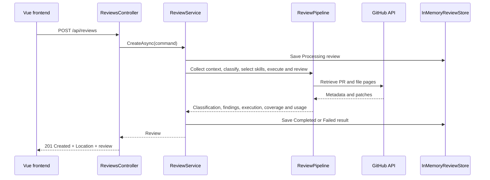

# SmartPRReview

A workspace for exploring GitHub pull requests and inspecting their changes, built
with **Vue 3 + TypeScript** and **ASP.NET Core 8**.

Load a repository's pull requests, filter and search the results, then select a
PR to retrieve its metadata and file diffs. Reviews run immediately and their
results are cached in memory.

**Current scope:** selectable OpenAI, Gemini and DeepSeek adapters classify changes and review them with versioned technology skills. Reviews stream progress and report evidence, coverage, execution results and token usage. Provider models must be configured and verified before use; see [deployment configuration](deploy/README.md). Recommendations are advisory and never publish decisions to GitHub.

## Contents

- [Quick start](#quick-start)
- [Features](#features)
- [Architecture](#architecture)
- [Configuration](#configuration)
- [API reference](#api-reference)
- [Build and test](#build-and-test)
- [Troubleshooting](#troubleshooting)
- [Deployment and limitations](#deployment-and-limitations)

## Quick start

### Prerequisites

- .NET SDK compatible with [global.json](global.json): `8.0.100` with
  `latestPatch` roll-forward within the `8.0.1xx` feature band. A later feature
  band alone does not satisfy this setting.
- Node.js 22.12+ or Node.js 24, with npm.
- A GitHub token with access to the repository when authentication is required.
- Microsoft Edge to run the browser tests with the default configuration.

Run the following commands from the repository root in two separate terminals.

**Terminal 1: backend**

```powershell
dotnet run --project backend/SmartPRReview.Api
```

**Terminal 2: frontend**

```powershell
cd frontend
npm ci
npm run dev
```

| Service | Default local URL |
| --- | --- |
| Vue application | http://localhost:5173 |
| Backend HTTP | http://localhost:62680 |
| Swagger UI | http://localhost:62680/swagger |
| Health check | http://localhost:62680/health |

In the application, enter a GitHub repository URL and optional token, select a
state, and click **Cargar pull requests**. Select a result and click
**Consultar revisión** to retrieve its review and file diffs.

The Vite development server forwards `/api` requests to the backend. No local
CORS configuration is required. If port 5173 is occupied, check the URL printed
by Vite.

## Features

- List all matching pull requests, fetching GitHub pages automatically.
- Filter by `all`, `open`, or `closed`; search loaded results by title, number,
  or author in the frontend.
- Display PR descriptions, authors, branches, state, and timestamps.
- Retrieve individual PR statistics, changed files, and available patches.
- Process reviews within the HTTP request, without a queue or background worker.
- Retrieve cached results by review ID.
- Supply a GitHub token per request or use a configured fallback.
- Use a responsive interface with loading, empty, and error states.

## Architecture

The backend uses a **Clean Architecture structure with selected DDD concepts**.
It separates domain behavior, application orchestration, infrastructure, and
HTTP concerns. It does not yet implement a full DDD model.

```text
SmartPRReview.sln
backend/
  SmartPRReview.Domain/          Review models and state transitions
  SmartPRReview.Application/     Use cases and dependency interfaces
  SmartPRReview.Infrastructure/  GitHub HTTP client and in-memory cache
  SmartPRReview.Api/             Controllers, contracts, and composition root
frontend/
  src/                          Vue interface, API client, and styles
  tests/                        Playwright browser tests
  vite.config.ts                Local API proxy configuration
```

| Layer | Responsibility | Examples |
| --- | --- | --- |
| Domain | Represent review data and lifecycle behavior | `Review`, `RepositoryReference`, `PullRequestSnapshot` |
| Application | Coordinate review creation and define external contracts | `ReviewService`, `IReviewStore`, `IRepositoryAnalyzer`, `IGitHubPullRequestClient` |
| Infrastructure | Implement external access and storage | `GitHubPullRequestClient`, `RepositoryAnalyzer`, `InMemoryReviewStore` |
| API | Validate HTTP input, return responses, and wire dependencies | `ReviewsController`, `PullRequestsController`, `Program.cs` |
| Frontend | Present repository and review workflows | `App.vue`, `api.ts` |

Project references point inward: Application references Domain; Infrastructure
references Application; API references Infrastructure to register implementations
at startup. Domain has no dependency on the other projects.

Review creation follows this runtime flow:



`Review` contains creation and completion/failure behavior, but the model remains
small. Domain events, explicit aggregate boundaries, and rich invariant
enforcement have not been introduced.

One application-layer shortcut remains: `PullRequestsController` calls the
application-defined `IGitHubPullRequestClient` interface directly. Listing does
not yet have a dedicated application use case, unlike review creation.

## Configuration

### AI credentials per review

Select the AI provider and models in Vue, then enter its key in **Clave de API de IA**.
The frontend sends it as `aiApiKey` in the review POST body. It stays in memory and
is not saved in browser storage, cached results or model prompts. Changing provider
clears the key. An optional configured server key is used only when the request key
is blank. See [AI configuration](deploy/README.md) for the complete request example,
model validation and optional server setup.

### GitHub authentication

The `gitHubToken` field is optional in both POST request bodies:

1. A nonblank request token takes precedence for that request, including its
   subsequent GitHub page requests.
2. If it is omitted or blank, the configured `GitHub:Token` is used.
3. If neither exists, GitHub requests are unauthenticated.

Set a fallback token before starting the backend:

```powershell
$env:GitHub__Token = "YOUR_GITHUB_TOKEN"
dotnet run --project backend/SmartPRReview.Api
```

Request tokens are not part of cached reviews or API responses. The frontend
keeps its token in memory and does not write it to browser storage; reloading
clears it. Use HTTPS when transmitting credentials outside local development.
Do not commit tokens or place them in `VITE_*` environment variables, which are
exposed to the frontend bundle.

### Backend settings

Defaults are defined in [appsettings.json](backend/SmartPRReview.Api/appsettings.json)
and the infrastructure options classes. ASP.NET Core environment variables use
`__` in place of `:`.

| Setting | Environment variable | Default |
| --- | --- | --- |
| GitHub API base URL | `GitHub__ApiBaseUrl` | `https://api.github.com/` |
| Fallback token | `GitHub__Token` | None |
| GitHub user agent | `GitHub__UserAgent` | `SmartPRReview` |
| Cached review lifetime | `ReviewCache__ReviewLifetime` | `1.00:00:00` (24 hours) |

### Frontend proxy

If your backend runs at a different address, run this from `frontend/`:

```powershell
Copy-Item .env.example .env.local
```

Edit `.env.local` and restart Vite:

```dotenv
API_PROXY_TARGET=http://localhost:62680
```

This setting is used by Vite's development and preview servers. It does not
configure routing for deployed static files.

## API reference

Request and response property names use camel case; enum values use strings.
Swagger provides the complete schemas at `/swagger`.

| Method | Endpoint | Behavior |
| --- | --- | --- |
| GET | `/api/ai/models` | Returns enabled providers and allowed models without secrets |
| POST | `/api/reviews/stream` | Runs the same review pipeline with NDJSON progress and final result |
| GET | `/health` | Returns `200` with `{ "status": "healthy" }` |
| POST | `/api/pull-requests/list` | Returns `200` with all matching PR summaries |
| POST | `/api/reviews` | Processes one review and returns `201` with its result |
| GET | `/api/reviews/{id}` | Returns a cached review, or `404` if unavailable |

### List pull requests

```http
POST /api/pull-requests/list
Content-Type: application/json

{
  "location": "https://github.com/UCR-Labs/Coope-Web",
  "state": "all",
  "gitHubToken": "YOUR_GITHUB_TOKEN"
}
```

`location` is required. `state` defaults to `all` and accepts `open` or `closed`.
Omit `gitHubToken` to use the configured fallback or unauthenticated access.

The response is an array, or `[]` when no PRs match. Each item includes number,
title, description, state, draft flag, author, URL, base/head branches, and
creation/update/close/merge timestamps. Merged PRs have a `mergedAt` value.
All matching pages are collected before the response is returned.

This endpoint lists metadata; it does not fetch patches or create reviews.
Invalid input returns `400`. Handled GitHub access and HTTP failures return
`502` with a problem-details response. POST allows the token to stay in the
request body rather than the URL.

### Create a review

```http
POST /api/reviews
Content-Type: application/json

{
  "provider": "GitHub",
  "location": "https://github.com/UCR-Labs/Coope-Web",
  "pullRequestNumber": 32,
  "baseReference": null,
  "headReference": null,
  "gitHubToken": "YOUR_GITHUB_TOKEN"
}
```

For GitHub retrieval, supply a PR number greater than zero. Base and head
references can be `null`: the current GitHub client retrieves branches from the
PR itself rather than using these fields to select changes.

The request waits for processing and returns `201 Created` with a `Location`
header pointing to `/api/reviews/{id}`. The review contains its ID, repository,
status, timestamps, summary, PR snapshot, findings, and any processing error.
The snapshot contains PR statistics and changed files with available patches.

**Check `status`, not only the HTTP status code.** A handled processing failure
also returns `201`, with `status: "Failed"` and an `error` message. A finished pipeline returns `status: "Completed"`; inspect `ai.recommendation` and coverage limitations separately. Invalid request input returns `400`.

### Retrieve a cached review

```http
GET /api/reviews/{id}
```

Use the ID returned when creating the review. Missing, expired, or lost-on-restart
entries return `404`. The default expiration is 24 hours after the last cache
write; reading a review does not extend its lifetime.

## Build and test

From the repository root:

```powershell
dotnet build SmartPRReview.sln
```

From `frontend/`:

```powershell
npm run build
npm test
```

`build` runs Vue/TypeScript checking and produces static assets in `frontend/dist`.
The Playwright suite covers listing/search, review retrieval and diffs, token
storage behavior, error states, and mobile layout. API responses are mocked, so
these tests require neither a running backend nor real GitHub credentials.
They are not live GitHub integration tests. Run the backend contract, pipeline, API and runner boundary tests with `dotnet test backend/tests/SmartPRReview.Tests`. Live provider evaluations and Docker execution require separately configured credentials and infrastructure.

Tests start their own Vite server on port 5173; stop an existing frontend server
on that port before running them. The default browser is Microsoft Edge. To use
Playwright-managed Chromium, remove `channel: 'msedge'` from
[playwright.config.ts](frontend/playwright.config.ts), then run:

```powershell
npx playwright install chromium
npm test
```

## Troubleshooting

| Symptom | Check |
| --- | --- |
| PR not found or token cannot access it | Confirm the repository URL, PR number, and token access to that repository. |
| GitHub rejected the token | Replace the request token or update `GitHub__Token`; a nonblank request token overrides the fallback. |
| GitHub denied access or rate limit exceeded | Check the credential's access and GitHub's rate-limit response. |
| Frontend cannot reach the backend | Open `/health` on the backend, check `API_PROXY_TARGET`, and restart Vite after configuration changes. |
| .NET SDK not found | Run `dotnet --list-sdks` and compare with the feature band pinned in `global.json`. |
| Backend build cannot copy DLLs | Stop the running API/debug session before rebuilding. |
| `npm ci` fails with `EPERM` on `rolldown-binding.win32-x64-msvc.node` | Stop this project's Vite development, preview, and test processes first (`Ctrl+C` in their terminals), then rerun `npm ci` from `frontend/`. Windows cannot replace the native module while a process is using it. |
| Browser tests fail to start | Check Edge availability and ensure port 5173 is free. |
| Review ID returns `404` | The entry may have expired, the API may have restarted, or the request reached another instance. |

## Deployment and limitations

- Serve `frontend/dist` and reverse-proxy `/api` to the backend on the same HTTPS
  origin. The Vite proxy is not included in the production bundle.
- Reviews are stored in process memory. There is no database, persistence across
  restarts, or shared cache between backend instances.
- Requests run immediately and remain open while GitHub data is fetched. Large
  repositories and PRs can take longer; there is no background job or polling flow.
- Only GitHub retrieval is implemented. Other provider enum values are placeholders.
- GitHub may omit patches for some files; the frontend indicates when no diff is
  available. It displays descriptions and patches as text.
- The API has no application-level authentication or authorization. GitHub tokens
  authorize outbound GitHub requests, not access to this application or its cached
  reviews. Access control is needed before exposing a multi-user deployment.
- `/health` reports application availability; it does not test GitHub connectivity.
